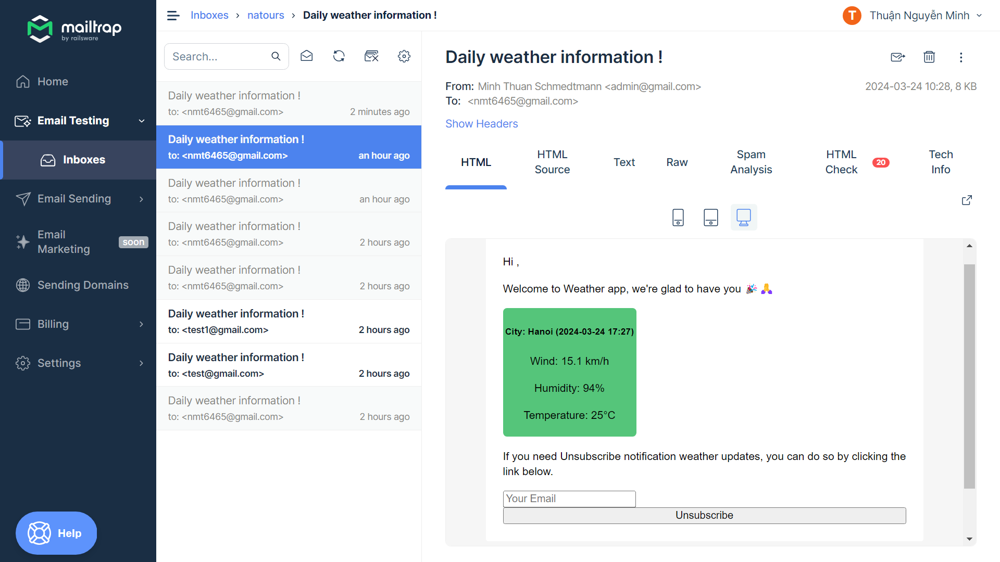

# Weather-app

## Công nghệ sử dụng : server side rendering nodejs , html, template pug, css, bootstrap, javascript,

## cách sử dụng :

1. clone code về
2. npm install
3. npm run watch:js
4. npm run dev
5. truy cập http://localhost:3000

##demo gửi mail

## demo gửi mail

.png>)
